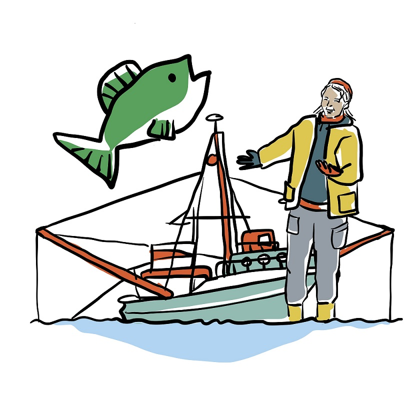

# Bottom Fishing Impact Assessment Tools

Functions to estimate the impact of bottom disturbances on sediment
ecosystems. 

## Author

Karline Soetaert, Olivier Beauchard

## References

Beauchard, O., Murray S.A. Thompson, Kari Elsa Ellingsen, Gerjan Piet,
Pascal Laffargue, Karline Soetaert, 2023. Assessing sea floor functional
diversity and vulnerability. Marine Ecology Progress Serie v708, p21-43,
https://www.int-res.com/abstracts/meps/v708/p21-43/

Data product created under the European Marine Observation Data Network
(EMODnet) Biology Phase V, under the NECCTON project (New Copernicus
Capability for Trophic Ocean Networks), and under the OceanICU
(understanding Ocean Carbon) project.
